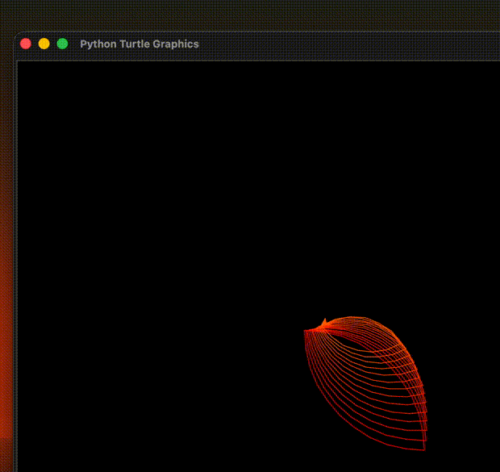

🎨 Colorful Turtle Graphics Pattern

A creative Python Turtle Graphics project that generates a colorful animated geometric pattern using the turtle and colorsys modules. The artwork is created by combining circles, rotations, and smoothly changing HSV colors.

✨ Features
🌈 Dynamic rainbow color transitions using the colorsys module
🐢 Beautiful geometric pattern created with Python Turtle
🎨 Smooth color animation
📚 Beginner-friendly project for learning graphics programming
💻 Built using Python's standard library
🛠️ Technologies Used
Python
Turtle Graphics
Colorsys

# Rainbow Turtle Spiral 🌈

Start coding in Python today!
